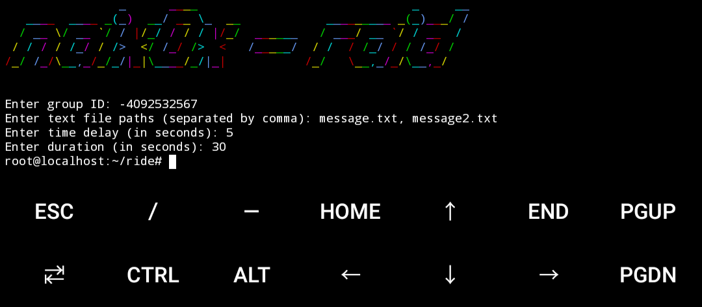
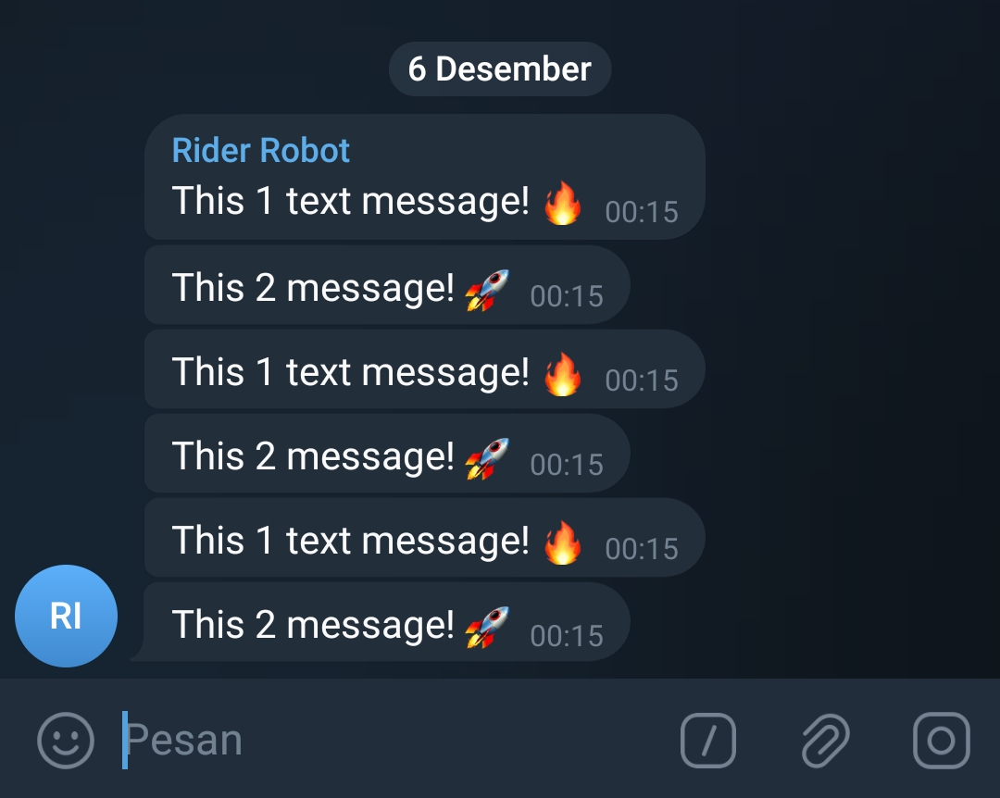

<h2 align="center">Raid Telegram</h1>

<p align="center">
    
</p>


Raid group with use a bot telegram, u can set things like delay time, time duration, text path (.txt) which contains the raid text you want.

#### Requirements

```python
pip install requirements.txt
```

#### Installation

```python
git clone https://github.com/naix0x/raid-telegram.git ride && cd ride
```

#### Execution

- Set youre token bot telegram in `config.py`

```python
nano config.py
```
- Create a file with any name, but it must have the extension .txt, and contain the text you want for the raid (the one below is just an example)

```python
nano message.txt
```

- Ready Lauch

```python
python3 main.py
```

#### Information

If you want more messages to be sent, screenshots like the one below, use a comma (,)

#### Result in telegram :

<p align="center">
    
</p>
